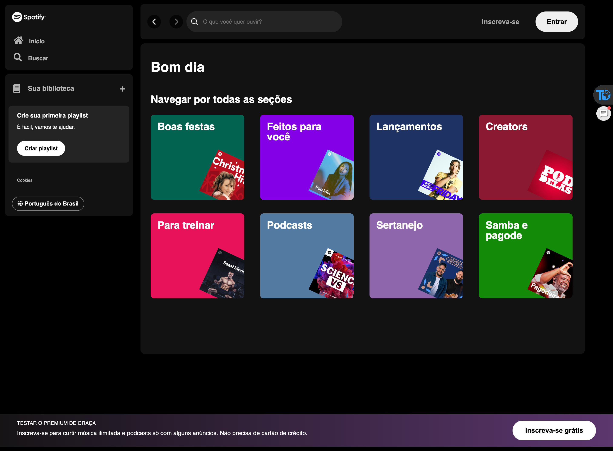

# 🎧 Página Inicial do Spotify — Projeto Imersão Alura

Bem-vindo(a)! Este é um projeto desenvolvido durante a **Imersão Alura**, onde recriamos a **página inicial do Spotify** com foco em responsividade e interatividade.

🔗 [Acesse o projeto aqui](https://luferdioly.github.io/ImersaoAlura/)

## 📌 Sobre o projeto

Este projeto tem como objetivo praticar e reforçar conhecimentos de **HTML**, **CSS** e **JavaScript**, criando uma interface moderna e parecida com a home do Spotify. Durante o desenvolvimento, foram trabalhadas habilidades como:

- Estruturação de página com **HTML semântico**
- Estilização com **CSS3** (cores, gradientes, posicionamento, responsividade)
- Interatividade com **JavaScript** (ex: botões e navegação)
- Utilização de **Flexbox** para layout responsivo

## 🛠️ Tecnologias utilizadas

- HTML5
- CSS3
- JavaScript
- Font Awesome (para ícones)
- Google Fonts

## 🎯 O que aprendi

- Criação de layouts responsivos inspirados em produtos reais
- Melhoria da organização de código e boas práticas
- Aplicação de interatividade básica com JavaScript

## 📷 Preview

